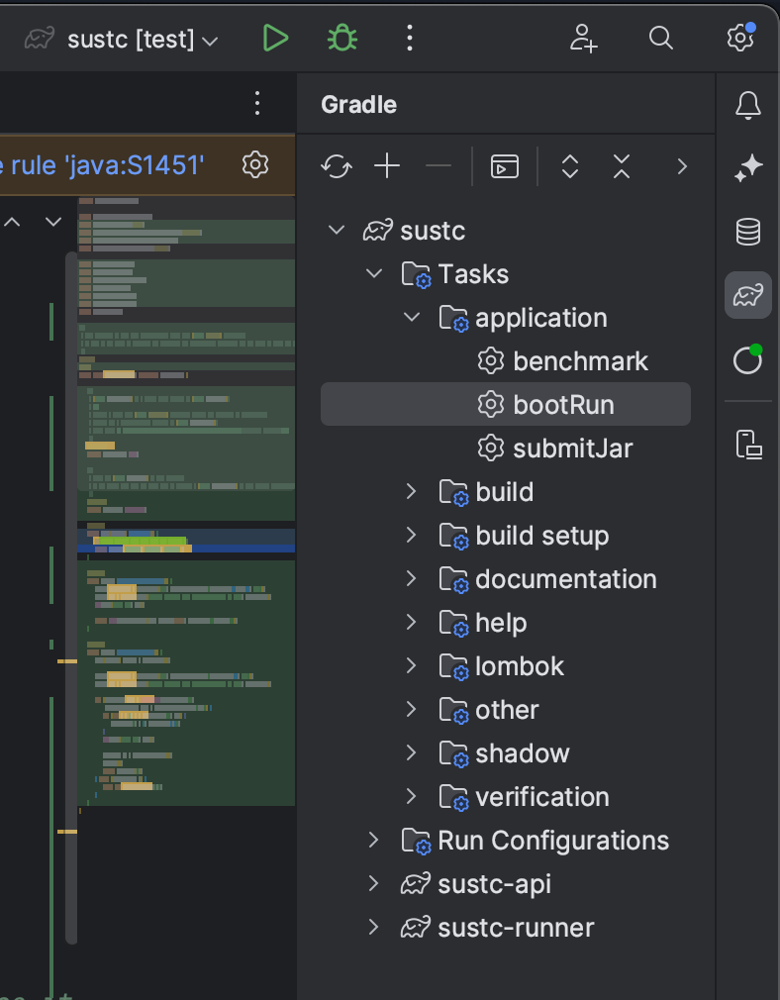

# 📺 SUSTech Database System Project 2


The world-leading ~~fictional~~ Danmaku video website, _Synchronized User-generated Subtitle Technology Company
(SUSTC)_, is now hiring your team to build a new backend system for them. Please use the code in this repository as a
template to start your work.

## Prerequisites

- **JDK**: This template requires JDK 8+ and is compatible up to Java 20. We will use _JDK 20_ to work around your
  submitted jar file.

  > Other JVM languages (Kotlin, Groovy) are supported as long as you build a jar file that can pass the local
  benchmark.

- **Database**: You need to host your own PostgreSQL database when developing. We will use _PostgreSQL 16_ to run
  the final benchmark.

  > As we may require you to return the sorted result in some query, please create the database with `LC_COLLATE='C'`
  option, which provides the platform-independent sorting result.
  > ```sql
  > CREATE DATABASE sustc WITH ENCODING = 'UTF8' LC_COLLATE = 'C' TEMPLATE = template0;
  >```

## Getting started

### 1. Setup your repository

Create a private copy of [the template repository](https://github.com/hezean/sustc) by clicking
the [Use this template](https://github.com/hezean/sustc/generate) button,
or [download a zip copy](https://github.com/hezean/sustc/archive/refs/heads/main.zip) to work without using git.

Consider _watching_ the template repository to track discussions/issues,
and receive notifications when we update the template.

> [!NOTE]  
> Please check the updates in the code framework regularly.
> To apply the changes to your repository, you can use the following commands:
> ```shell
> # this command is only required for the first time
> git remote add upstream https://github.com/hezean/sustc.git  # or `git@github.com:hezean/sustc.git` for git protocol
> 
> git fetch upstream
> # better to commit your changes before merging
> git merge upstream/main --allow-unrelated-histories
> # then resolve the conflicts (if any) and commit the changes
> ```

### 2. Understand the project structure

<details>
<summary><b>Expand this section to see the sample code tree</b></summary>
<pre>
.
├── sustc-api                                              # You should work around this directory
│   ├── build.gradle.kts                                   # You may add any utility libraries here
│   └── src/main/java
│                └── io.sustc
│                    ├── dto                               # The passed arguments and return values of services are defined as DTO (Data Transfer Object)
│                    │   └... User.java                    # You should not modify the defined fields or methods, but you may add new ones
│                    ├── exceptions                        # You should throw correct exceptions as instructed in JavaDoc
│                    │   └... EntityNotFoundException.java
│                    └── service                           # The interfaces of services are defined here
│                        ├... DatabaseService.java
│                        └── impl                          # We suggest you to place your implementation here. Actually, any package is OK, as long as annotating the class as `@Service`
│                            └... DatabaseServiceImpl.java
└── sustc-runner                                           # We've provided you an interactive command line runner, a benchmark runner with sample data, and unit tests
    ├── compose.yml                                        # You may optionally use a container-based database to prevent polluting your local database
    ├── data                                               # Contains records to import and test cases
    └── src/main
            ├── java
            │   └── io.sustc
            │       └── command                            # You may call the services here, type `help` in shell to list all commands
            │           └... UserCommand.java
            └── resources
                └── application.yml                        # Configure your database connection and benchmark behavior here
</pre>

You don't need to care about the unlisted files and directories.
</details>

The project is managed by Gradle to help you manage dependencies, run locally, and build the submission.

- [`sustc-api`](sustc-api) is the module where you should implement your services.
- [`sustc-runner`](sustc-runner) module provides you an interactive command line runner and a benchmark runner with sample data.

Basically, you only need to focus on three directories:

1. [`io.sustc.service`](sustc-api/src/main/java/io/sustc/service) package contains the interfaces of services you
   need to implement. You
   should not modify the interfaces. A demo implementation is provided in
   [`DatabaseServiceImpl`](sustc-api/src/main/java/io/sustc/service/impl/DatabaseServiceImpl.java).
   **Please also update the `getGroupMembers` method to help us identify your submission.**

2. [`io.sustc.dto`](sustc-api/src/main/java/io/sustc/dto) package contains the definitions of DTOs (Data Transfer
   Objects) that act as the arguments and return values of services. You should not modify the defined fields or
   methods, but you may add new ones.

3. [`application.yml`](sustc-runner/src/main/resources/application.yml) is the configuration file for running the
   program. You may configure your database connection and benchmark behavior here.

Please note that your submission is built by the `sustc-api` module, any modification to the `sustc-runner` module will
not take effect in the final benchmark.

### 3. Run locally

After setting up your database and modifying the configuration file, you may run the program locally in two modes.

#### 3.1 Interactive shell

You can test your services by typing commands in any sequence, with any data. Run the Gradle task named **`bootRun`**
to start the interactive shell.

```shell
./gradlew :sustc-runner:bootRun  # or simply   ./gradlew bootRun
```

> If you are using IntelliJ IDEA, you may find the list of Gradle tasks on the right side of the window.
<p align="center"></p>

You may type `help` after the application starts up to see the list of available commands.

#### 3.2 Benchmark with sample data

[The benchmark service](sustc-runner/src/main/java/io/sustc/benchmark/BenchmarkService.java) works exactly the same as how
we will judge your submission, which grades your services based on both correctness and performance.
To run the benchmark, use the **`benchmark`** Gradle task.

Note that you need to implement all service interfaces to run the benchmark.
You may create dummy implementations (e.g. throw UnsupportedOperationException) before actually implementing them.

## Submitting your work

As previously mentioned, you need to submit a jar file that contains your implementation of the services
(and any dependencies you added). To build it, run the **`submitJar`** Gradle task.

```shell
./gradlew submitJar
```

Then you should find a `submit` folder under the root of project, containing a single jar file
(its size should be about 8~10 MB if you didn't add any additional dependencies).
**We don't accept jar files larger than 20 MB, so please don't add too much dependencies.**

> If any jar file presents in the `submit` folder, the runner will use it
> instead of the latest code in `sustc-api` module.

Then create exactly one SQL file (any filename is acceptable) under the `submit` folder
that could properly initialize your database.
You don't need to include a `create database` statement in your submission, as we will create the database for you.

```text
submit              # Under the root of project
├── schema.sql      # Any filename is acceptable
└── sustc-api.jar   # Produced by `submitJar` task
```

Then zip the `submit` folder (unzip should produce a folder named `submit`, instead of any other folder name, or the
separated jar and sql files).

Also, similar to other courses, we require you to submit your source code for academic purposes and plagiarism
detection. Please run the `clean` task before archiving your source code, which will delete the built files.

```shell
./gradlew clean
```

After cleaning up, the source archive of __sustc-api__ should not be larger than 10 MB.

Finally, upload these zip files with any other resources as specified to Blackboard.

## More Information

Please also read the project requirements document posted on [Blackboard](https://bb.sustech.edu.cn).

If there's anything ambiguous about the document or the instruction above,
feel free to [open an issue](https://github.com/hezean/sustc/issues/new) and ask.
Your question may also help others to better understand this project. 🔥

## Useful links

- [PostgreSQL 16 Documentation](https://www.postgresql.org/docs/16/index.html)
    - [Backward Compatibility](https://www.postgresql.org/docs/16/runtime-config-compatible.html)
- [SpringBoot 2.7 Documentation](https://docs.spring.io/spring-boot/docs/2.7.16/reference/htmlsingle/)
- [Lombok Documentation](https://projectlombok.org/features/)
- [Gradle User Manual](https://docs.gradle.org/8.3/userguide/userguide.html)
    - [Managing dependencies with Gradle](https://www.baeldung.com/gradle#plugins)

## License

The project is designed for educational purpose for the course _CS307 Principles of Database Systems_ and
_CS213 Principles of Database Systems (H)_ at Southern University of Science and Technology.

The code template is licensed under the MIT License — see the [LICENSE](LICENSE) file for details.
